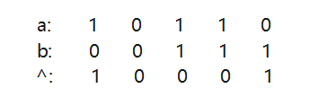
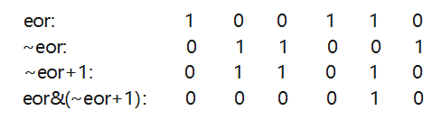

### 1.1 常数操作
与数据量无关的操作，如数组取某一元素的值 $a = arr[i]$

### 1.2 时间复杂度
一个程序所用的常数操作的总和，同时去掉总和中的低阶项以及高阶项的系数，用$O(f(n))$表示，如时间复杂度$O(n^2)$、$O(n)$、$O(nlogn)$、$O(logn)$等。

### 1.3 选择排序
选择排序的流程（假设数组大小为N）：首先，从第1个数往右依次寻找数组中最小的数，找到之后将其与第一个数交换位置；然后，从第2个数开始往右遍历，找到最小的数，然后将其与第2个数交换位置；依次类推，就得到了一个升序后的数组。

下面来分析选择排序的时间复杂度：

* 第1次遍历：N次查看数据、N次比较、1次交换
* 第2次遍历：N-1次查看数据、N-1次比较、1次交换
* ...

那么最后共有：
* 查看数据：N + N-1 + N-2 + ... + 1
* 比较数据：N + N-1 + N-2 + ... + 1
* 交换数据：1 + 1   + 1   + ... + 1

以上三项相加为：$$aN^2 + bN + c$$
去掉低阶项以及高阶项的系数，那么选择排序的时间复杂度为$O(N^2)$，空间复杂度为$O(1)$。

### 1.4 冒泡排序
从左往右两个相邻的数互相比较，将较大的数往右移，那么第一次遍历完就将最大的数放在了最后。同理，第二次遍历也一样，只不过只遍历到倒数第二个位置。以此类推，就得到了一个升序的数组。

冒泡排序的时间复杂度为：$O(N^2)$，空间复杂度为：O(1)。

### 1.5 异或运算
**相同为0，不同为1**

比如：



**异或运算**还可以理解为**无进位相加**。

异或运算的性质：

* 0 ^ N  =  N
* N ^ N  =  0
* 满足交换律：a ^ b  =  b ^ a
* 满足结合律：(a  ^  b)  ^  c  =  a ^ (b ^ c)

常用位运算用法：
* N & (~N) = 0
* N & (~0) = N

例1：利用异或运算来交换两个变量的值，同时不采用第三个变量。

如下：

int a = 甲

int b = 乙

那么，交换a和b的值就用如下代码：
```
a = a ^ b  # a = 甲 ^ 乙   b = 乙
b = a ^ b  # a = 甲 ^ 乙   b = 甲 ^ 乙 ^ 乙 = 甲
a = a ^ b  # a = 甲 ^ 乙 ^ 甲 = 乙   b = 甲
```

**注意：能够使用上述写法的前提是在内存中a和b位于不同的地址，否则a和b异或的结果就是0。**


例2：给定一个数组，
1）只有一种数出现了奇数次，其余的数都出现了偶数次
2）只有两种数出现了奇数次，其余数都出现到了偶数次
求出现奇数次的数。

1）代码：
```python
eor = 0
for num in nums:
    eor ^= num
return eor
```
将$eor = 0$依次与数组中的每一个元素进行异或运算，然后得到的结果就是出现奇数次的那个数。出现偶数次的数和自己进行异或运算的结果均为0，而出现奇数次的数和自己异或的结果为该奇数。所以，最后剩下的就是那个出现奇数次的数了。


2）代码
```python

```
 首先，同样是采用依次对数组中的元素进行异或运算，即：
 ```python
eor = 0
for num in nums:
    eor ^= num
 ```
 假设数组中出现奇数次的两个数分别为a和b，那么经过经过上一步的操作之后 eor = a ^ b。

 那么，因为$a \neq b$，所以$eor \neq 0$。那么在eor中（二进制表示下）至少有1个1，也就是说a和b至少有一位是不相同的。假设a的某一位为1，b对应为位置的数为0，在这里假设a和b在第8位不同。

 根据上述分析，我们可以通过在第8位的不同将剩下的数分为两类：一类为第8位为1的，另一类是第8位为0的。注意：这两类数中，每个数出现的次数都为偶数。

 那么我们只对第8位为1的数进行异或，最后的结果为$eor^{'} = a$，那么$b = eor$ ^ ${eor^{'}}$。

在这里关键是找到a和b不同的位置，下面的一行代码就能找到eor最右侧的1.
```python
right_one = eor & (~eor + 1)
```
解释：



所以，要获得a，则：
```python
eor' = 0
right_one = eor & (~eor + 1)
for num in nums:
    if right_one & num != 0:
        eor' ^= num
```
最后eor' = a，则b = eor' ^ eor。

### 1.6 插入排序

[0   1   2   ...   n] n+1

数组在0~n位置上是有序的，当第n+1个数来的时候，判断0~n+1位置上是否有序。不是的话，那么用当前的数与前一个数交换，则当前的数字变为前1个数；然后判断当前的数与前面的数是否有序，如果有序则结束；无序的话则交换。以此类推进行操作，直到数组有序。插入排序的时间复杂度$O(N^2)$，空间复杂度$O(1)$。


### 1.7 二分法
用法：

* 在一个有序数组中，找一个数是否存在（二分查找：$O(logn)$）
* 在一个有序数组中找>=某个数最左侧的位置
* 局部最小值问题

注意：二分法不一定要保证数组有序

求区间[L, R]的中点：

* $mid = L + \frac{R-L}{2}$
* $mid = L + ((R-L)) >> 1$


### 1.8 对数器

* 有一个你想要测的方法a
* 实现复杂度不好但是容易实现的方法b
* 实现一个随机样本产生器
* 把方法a和b跑相同的随机样本，看看得到的结果是否一样
* 如果有一个随机样本使得比对结果不一致，打印样本进行人工干预，改对方法a或者b
* 当样本数量很多时，比对测试结果依然正确，可以确定方法a已经正确